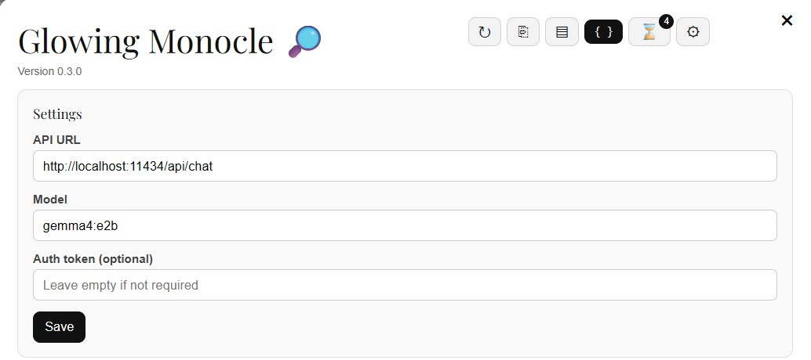
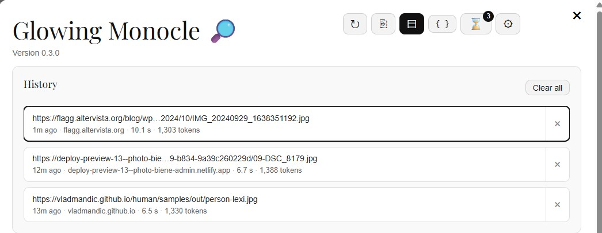
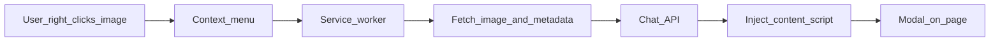

# Glowing Monocle

A Chromium extension (Manifest V3) that analyzes images in the browser using a local [Ollama](https://ollama.com/) chat API with vision support. Works in Chrome, Brave, Edge, and other Chromium-based browsers.

**Version:** 0.3.1

## Preview


*Formatted report — description, tags, color palette, and analysis metadata.*



*Settings — configure the API URL, model, and auth token from the modal.*



*History — browse and restore previous analyses from any site.*

## Features

- **Image context menu** — right-click any image and choose **Glowing Monocle**.
- **In-page modal** with:
  - **Formatted** report — grid layout with sections for description, tags, color palette (swatches), anomalies, and NSFW status
  - **Raw JSON** tab — full API response
  - **Metadata badges** — image dimensions, aspect ratio, file size, generation time, and token usage
  - **Run** (↻) — re-run analysis on the same image (disabled while running)
  - **Copy JSON** (⎘) — copy the raw response
  - **History** (⌛) — browse and restore past analyses (extension-wide, up to 30 entries)
  - **Settings** (⚙) — configure API URL, model, and optional auth token
- **Friendly error messages** when the API is unreachable, the model is missing, or the image cannot be loaded.
- **Persistent settings and history** via `chrome.storage.local` (shared across all websites and browser tabs).

## How it works



1. The service worker fetches the image bytes and reads metadata (width, height, aspect ratio, file size).
2. The image is sent to the configured chat endpoint as base64 in a `/api/chat` payload.
3. The content script shows a loading spinner, then renders the formatted report or an error panel.
4. Successful results are saved to extension history automatically.

## Requirements

- **Ollama** (or any compatible chat API) running with a **vision-capable** model.

  Default model: **`gemma4:e2b`**

  ```bash
  ollama run gemma4:e2b
  ```

  See [Gemma models on Ollama](https://ollama.com/library/gemma4) or the [model search](https://ollama.com/search) for other vision-capable tags.

- **CORS for extensions** — start Ollama with origins that allow the extension:

  Unix-like / macOS:

  ```bash
  OLLAMA_ORIGINS=chrome-extension://* ollama serve
  ```

  Windows (Command Prompt):

  ```bat
  set OLLAMA_ORIGINS=chrome-extension://*
  ollama serve
  ```

- Verify Ollama is running: [http://localhost:11434/api/tags](http://localhost:11434/api/tags)

## Install

1. Clone this repository.
2. Open `chrome://extensions/`.
3. Enable **Developer mode**.
4. Click **Load unpacked** and select the repository root (the folder containing `manifest.json`).
5. Ensure the `icons/` directory contains the PNG files referenced in `manifest.json`.

There is **no** npm/yarn build step — load the folder as-is.

## Usage

1. Open a page that displays images.
2. **Right-click the image** (the toolbar icon does not open a popup; the context menu is the entry point).
3. Choose **Glowing Monocle**.
4. Wait for the spinner to finish. The formatted report appears with metadata badges above the grid.
5. Use the header icon buttons:
   - **↻** — run or re-run analysis
   - **⎘** — copy raw JSON
   - **▤** / **{ }** — switch between formatted and raw views
   - **⌛** — open history; click an entry to restore it, or **×** to remove one
   - **⚙** — open settings
6. Close the modal with **×** or by clicking the backdrop.

### History

- Every successful analysis is saved automatically (URL, page URL, formatted result, raw JSON, image metadata).
- History is stored in **`chrome.storage.local`** — it is **global** across all websites and tabs, not scoped to a single page origin.
- Up to **30** entries are kept (newest first).
- On analysis failure, the history panel opens automatically if previous results exist.

## Configuration

Settings can be changed in the modal (**⚙**) without editing source code. Values are persisted in `chrome.storage.local`.

| Setting | Default | Description |
|---------|---------|-------------|
| **API URL** | `http://localhost:11434/api/chat` | Chat endpoint (Ollama or compatible) |
| **Model** | `gemma4:e2b` | Model name sent in the request body |
| **Auth token** | *(empty)* | Optional bearer token; sent as `Authorization: Bearer …` only when set |

Defaults are defined in `config.js`. The service worker reads saved settings at analysis time.

To change defaults in source (optional), edit `config.js`:

```js
const DEFAULT_CONFIG = {
  apiUrl: "http://localhost:11434/api/chat",
  model: "gemma4:e2b",
  authToken: ""
};
```

If you use a non-localhost API host, ensure it is reachable and that `host_permissions` in `manifest.json` covers it (broad `http://*/*` and `https://*/*` are already included for image fetching).

## Privacy and permissions

| Permission | Why |
|------------|-----|
| `contextMenus` | Add **Glowing Monocle** to the image right-click menu |
| `scripting` / `activeTab` / `tabs` | Inject the modal content script into the active tab |
| `storage` | Save settings and analysis history |
| `http://localhost:11434/*` | Default Ollama API |
| `http://*/*` / `https://*/*` | Fetch image URLs from any site you analyze |

Image bytes are sent only to the chat endpoint you configure (by default, your local Ollama instance). Nothing is sent to third-party servers unless you point the API URL elsewhere.

## Project layout

| Path | Role |
|------|------|
| `manifest.json` | MV3 manifest, permissions, web-accessible resources |
| `service-worker.js` | Context menu, image fetch, metadata extraction, API call, orchestration |
| `config.js` | Default config, settings/history storage helpers (loaded by service worker) |
| `content.js` | Modal UI, report parsing/rendering, history, settings, copy, retry |
| `content.html` / `content.css` | Modal markup and styles |
| `icons/` | Extension and toolbar icons |
| `result.html` / `result.js` | Standalone debug page; not wired in the manifest |

## Formatted report

The **Formatted** tab parses the model's markdown response into a card grid:

- **Description** and **Anomalies** — full-width prose cards
- **Categories/Tags** — pill chips
- **Color Palette** — swatches with hex codes (supports markdown tables and bullet lists)
- **NSFW Status** — yes/no badge with explanation text

Section headers using `##` or `###` are both supported. Preamble lines (e.g. "As a Glowing Monocle…") and horizontal rules are ignored.

Rendering is handled by a lightweight converter in `content.js`, not an external markdown library.

## Troubleshooting

| Problem | What to try |
|---------|-------------|
| **Cannot reach the API** | Confirm Ollama is running and `OLLAMA_ORIGINS=chrome-extension://*` is set |
| **Model not found (404)** | Check the model name in **Settings** matches an installed model (`ollama list`) |
| **Could not load the image** | Some sites block hotlinking; open the image in a new tab and analyze from there |
| **Extension won't load** | Verify all icon PNGs exist under `icons/` |
| **History empty on another site** | Reload the extension after updating; history uses `chrome.storage.local` and should appear everywhere |

## License

See [LICENSE](LICENSE).
